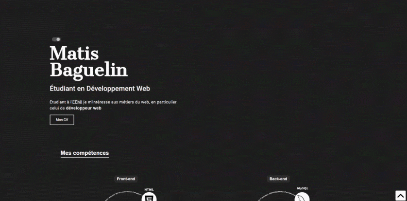

# Portfolio

Clique [ici](http://matisbaguelin.fr/) pour visualiser mon Profolio.

L'objectif était de réaliser une [maquette](https://i.pinimg.com/originals/7c/39/00/7c3900c859005ec907114689f79da4a3.jpg) complète, responsive.

## Langages utilisés 

* HTML5 / CSS (SASS)
* Javascript

## Aperçu

## Auteur(s) & date

* **Matis BAGUELIN**

*Mai 2020 - Aujourd'hui*
